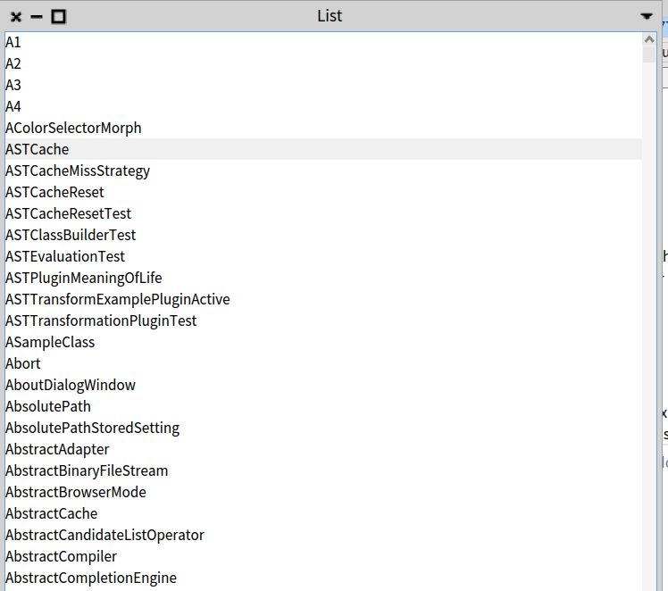

# Label Contractor

## **Installation**
In order to install this project, on a Pharo 9.0/Moose Suite 9.0 image execute the following script in the Playground:
```Smalltalk
Metacello new
  baseline: 'LabelContractor';
  repository: 'github://reda-idtaleb/LabelContractor/src';
  load.
```  
### Load full project
The full project includes examples of its application on [Roassal](https://github.com/ObjectProfile/Roassal3) visualizations or [Spec2](https://github.com/pharo-spec/Spec)(a list of all classes in the system generated by spec2), run the following code.
```Smalltalk
Metacello new
  baseline: 'LabelContractor';
  repository: 'github://reda-idtaleb/LabelContractor/src';
  load: 'full'.
``` 
## **LabelContractor description**
The LabelContractor is a "tool" will allow reducing labels on visualizations using different strategies. Currently, the Contractor provides 13 different contraction strategies and 2 ways to combine them.

## **Contents:**
- [Description of each strategy](#strategies-description)
- [How to combine strategies](#how-to-combine-strategies)
- [How to use the Contractor](#how-to-reduce-a-string-using-contractor)

## The original images of the examples on which the different strategies are applied:
The first image represents an example of visualization which contains boxes with labels above and the second image is a list of all the classes of the system built by spec2.
<p float="left">
  
   
</p>

## **Strategies description**

*For each strategy, we show two examples, the top image represents the application of a strategy to a visualization and the one at the bottom is the application of a strategy to a list of all classes in the system generated by spec2.*

**Note:** By default we remove 'path' if the string to be reduced represents a fully qualifed file name(but theres an option to keep it).  
There are 13 ways to reduce labels:

### **1. LbCAbbreviateNamesStrategy**
It allows to keep only the initial letter of each name except the last one('ExampleSomething' -> 'ESomething'). By default it takes the 1st letter of the first 3 names.
<p float="left">
  
   
</p>

### **2. LbCRemoveFilenameExentsionStrategy** 
For strings representing a fully qualified filename, only the name of the file is kept by removing its extension. (eg: 'example.txt' -> 'example').

### **3. LbCEllipsisStrategy** 
Consists in keeping a certain first and last letter of the string separated by 2 dots ('..'). By default we reduce up to 8 characters (without counting '..'). ('anExample' -> 'anEx..mple').
<p float="left">
  
   
</p>

### **4. LbCPickFirstCharactersStrategy** 
Allows to keep some first letters of the string. By default, we keep the 8 first letters.
<p float="left">
  
   
</p>

### **5. LbCRemoveFrequentLettersStrategy:** 
Allows you to remove frequent letters from a string until having the choosen size. By default we reduce until having a string of length 8.
<p float="left">
  
   
</p>

### **6. LbCRemoveAnySubstringStrategy** 
Allows you to remove all the occurrences of each substring from the string you want to reduce.

-> on the following visualization(left picture) we have removed { 'Hashed'. 'Moose'. 'value'. 'Identity' } from labels.

-> on the spec list(right picture) we removed the following substrings { 'ast'. 'Test'. 'Abstract' }.
<p float="left">
  
   
</p>

### **7. LbCRemovePrefixStrategy:** 
Allows you to remove a substring(s) which is the prefix of the string you want to reduce.

-> on the following visualization(left picture) we have removed { 'Hashed'. 'Moose'. 'Wide'. 'small'. 'Identity' } from labels.

-> on the spec list(right picture) we removed the following substrings { 'abstract'. 'ast' }.
<p float="left">
  
   
</p>

### **8. LbCRemoveSuffixStrategy** 
Allows you to remove a substring(s) which is the suffix of the string that you want to reduce.

-> on the following visualization we removed { 'Storage'. 'Moose'. 'Bag'. 'Array'. 'set' } from labels

-> on the spec list(right picture) we removed { 'Test' }

<p float="left">
  
   
</p>

### **9. LbCRemoveVowelsStrategy:** 
Consists in removing all the vowels (the letter 'y' is an exception in English, it's removed only when it represents a vowel) from the string.
<p float="left">
  
   
</p>

### **10. LbCRemoveAnyWordsAtStrategy:** 
Allows you to remove some words(one or a group) specified by its indexes. In this strategy, we also avoid having an empty string after the reduction. That is to say that the strings composed of only one word are never reduced (otherwise, we completely lose the information).

**Example: remove the 4th word(wich is 'Filename')**

LbCRemoveFilenameExtensionStrategy </br>
--> LbCRemoveExtensionStrategy

**Explication:**

    splitted string: Lb|C|Remove|Filename|Extension|Strategy 
    index of words : 1 |2|   3  |    4   |    5    |    6

### **11. LbCRemoveFirstWordStrategy** 
This is a specific case of the last strategy, it allows you to remove only the first word(word at index 1).

### **12. LbCRemoveLastWordStrategy** 
The same logic, it allows you to remove only the last word.

### **13. LbCSubstituteSubstringsStrategy** 
It is a strategy that makes it possible to replace an old substring with a new one.

# **How to combine strategies**
## **The user provides an order of strategies**
The user can provide an order of strategeis, and we apply them one by one.

**Example:**
ClyMergedSuperclassesAndInheritedTraitsHierarchyTest </br></br>
RemovePrefixStrategy ('Cly') </br>
RemoveSuffixStrategy ('Test') </br>
RemoveVowelsStrategy </br>
AbbreviateNamesStrategy (4) </br>
---> MSAITrtsHrrch 

## **Combining following predefined priorities**
Sometimes, it is difficult to order the strategies by yourself, that's why we provide an "automatic" version which will allow you to order the strategies according to their priority. Therefore, you only have to specify the strategies, regardless of their orders.

## **How to reduce a string using contractor**
The API is based on the design strategy, so for example to use a "remove vowels strategy" you can type on the playground:

```Smalltalk
LbCContractor new
  removeVowels;
  reduce: 'HashedCollection'. 
```    

**To keep path:**
```Smalltalk
LbCContractor new
  keepPath;
  removeVowels;
  reduce: 'Calypso-SystemPlugins-Traits-Queries-Tests/ClyMergedSuperclassesAndInheritedTraitsHierarchyTest.st'
``` 

**Combining strategies following user-defined order**
```Smalltalk
LbCContractor new
  removeVowels;
  removePrefix: 'Hashed';
  removeFrequentLetters;
  reduce: 'HashedCollection'
``` 

**Combining strategies following predefined
priorities**
```Smalltalk
LbCContractor new
  usingPriorities;
  removeVowels;
  removePrefix: 'Hashed';
  removeFrequentLetters;
  reduce: 'HashedCollection'
``` 
