# visu_roassal

## Installation
In order to install this project, execute the following script in the Playground of your Moose Image

```Smalltalk
Metacello new
  baseline: 'LabelContractor';
  repository: 'github://reda-idtaleb/label_contractor';
  load.
```  

## LabelContractor description:
The LabelContractor is an API will allow reducing labels on visualizations using different strategies.
In what follows, I will present the strategies that I have implemented.

**Note: at the moment we cannot combine the strategies (I will work on it next week)**

**For each strategy we display two examples, the image on the left represents the application of the strategies on a visualization and the one on the right are the application of the strategies on a list spec.**

1- LbCAbbreviateNamesStrategy: it allows to keep only the initial letter of each name except the last one('ExampleSomething' -> 'ESomething'). By default it takes the 1st letter of the first 3 names.
<p float="left">
  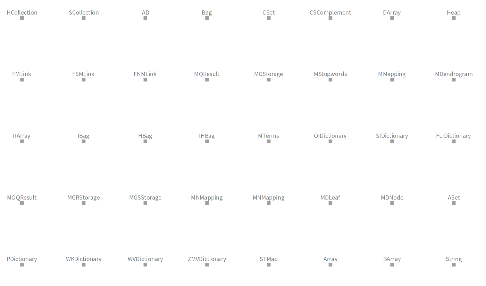
  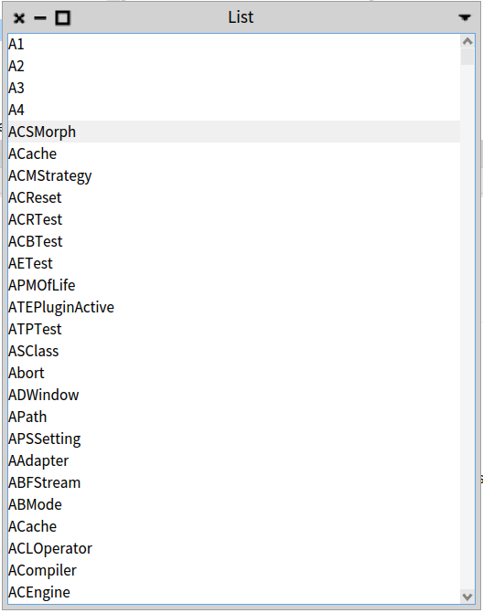 
</p>

2- LbCBaseNameStrategy: for strings representing an absolute file paths, only the name of the file is kept by removing the path and its extension. ('A: path/example.txt' or 'example.txt' -> 'example').
<p float="left">
  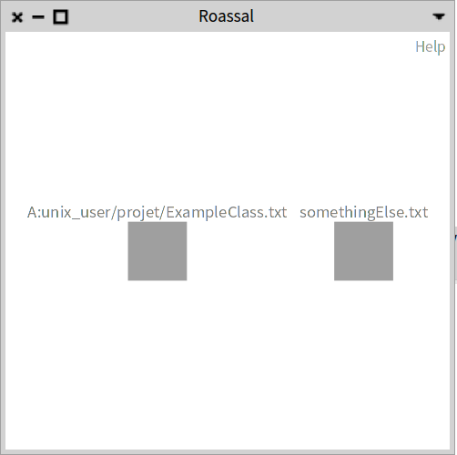
  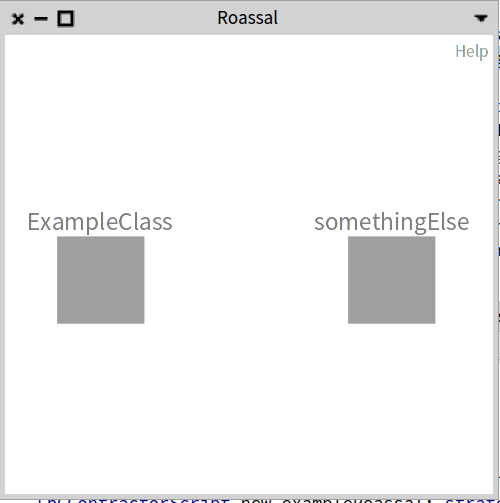 
</p>


3- LbCEllipsisStrategy: consists in keeping a certain first and last letter of the string separated by 2 dots ('..'). By default we reduce up to 8 characters (without counting '..'). ('anExample' -> 'anEx..mple').
<p float="left">
  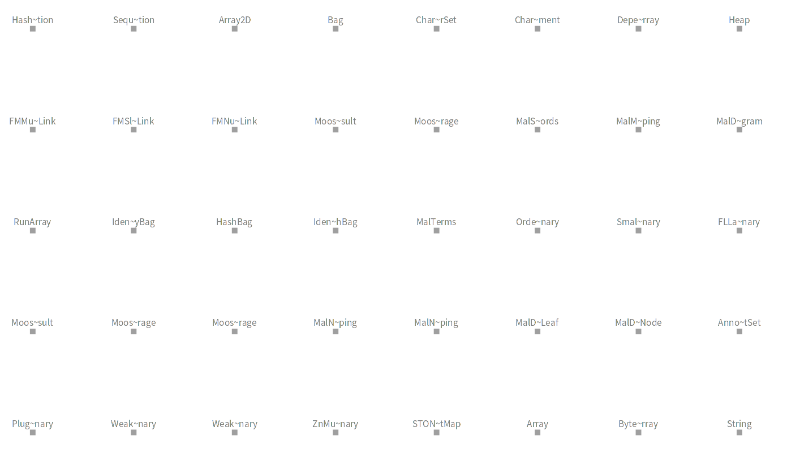
  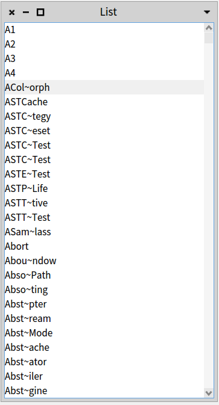 
</p>

4- LbCPickFirstLettersStrategy: allows to keep some first letters of the string. By default, we keep the 8 first letters.
<p float="left">
  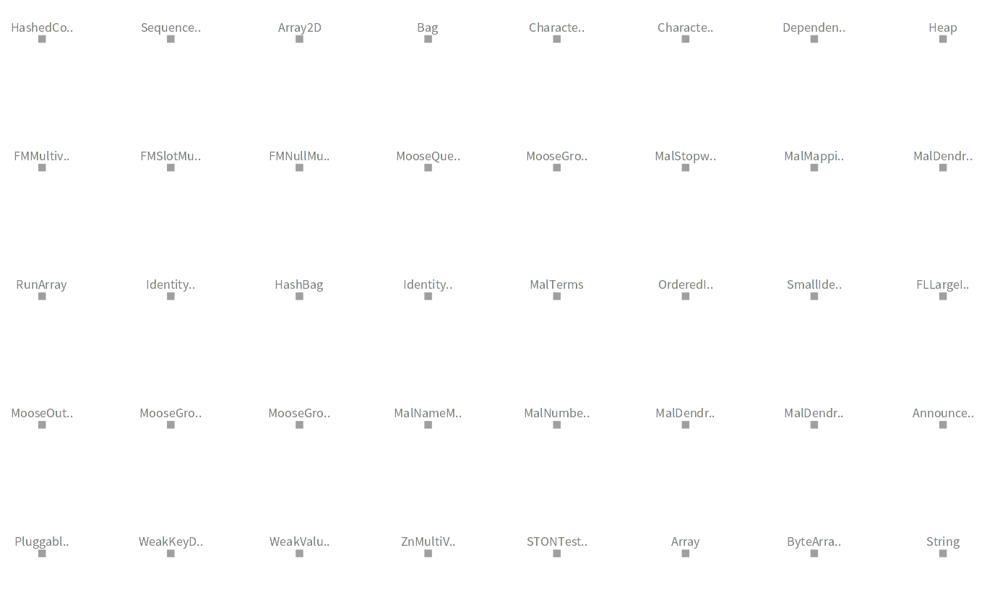
  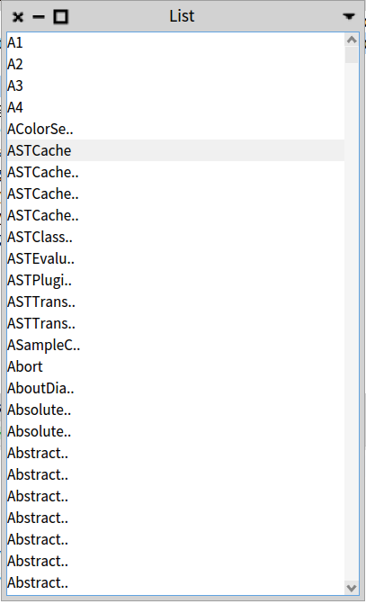 
</p>

5- LbCRemoveFrequentLettersStrategy: allows you to remove frequent letters from a string until having the choosen size. By default we reduce until having a string of length 8.
<p float="left">
  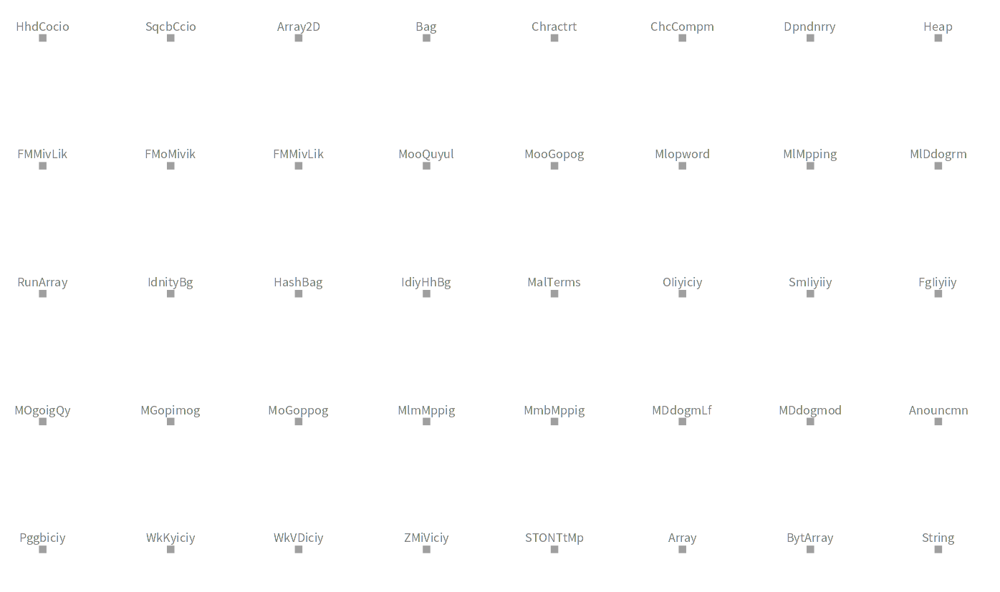
  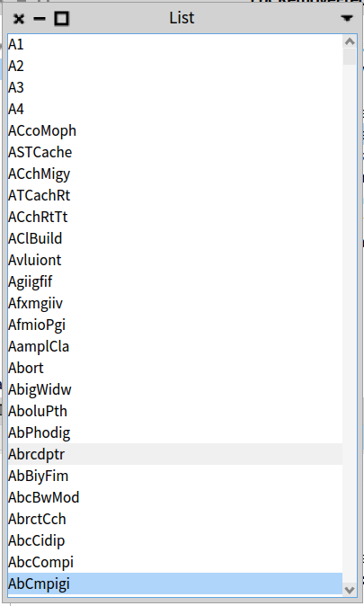 
</p>

6- LbCRemoveAnySubstringStrategy: allows you to remove all the occurrences of each substring from the string you want to reduce.

-> on the following visualization(left picture) we have removed { 'Hashed'. 'Moose'. 'value'. 'Identity' } from labels.

-> on the spec list(right picture) we removed the following substrings { 'ast'. 'Test'. 'Abstract' }.
<p float="left">
  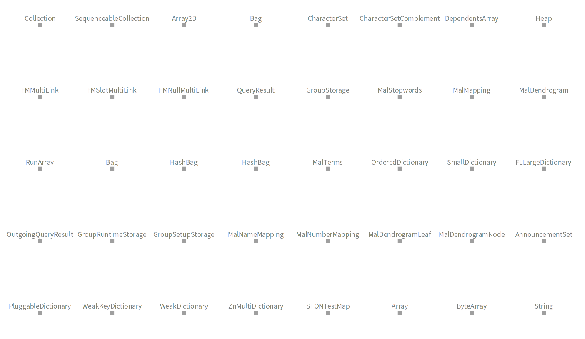
  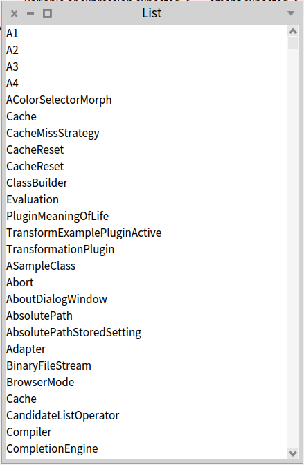 
</p>

7- LbCRemovePrefixStrategy: allows you to remove a substring(s) which is the prefix of the string you want to reduce.

-> on the following visualization(left picture) we have removed { 'Hashed'. 'Moose'. 'Wide'. 'small'. 'Identity' } from labels.

-> on the spec list(right picture) we removed the following substrings { 'abstract'. 'ast' }.
<p float="left">
  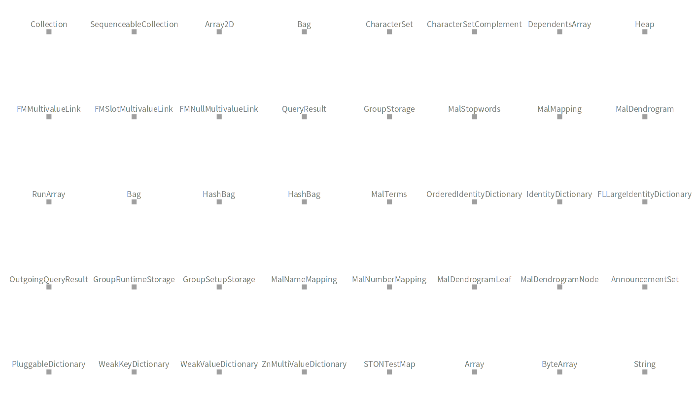
  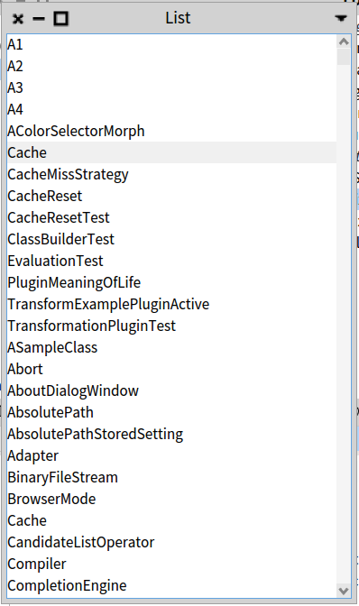 
</p>

8- LbCRemoveSuffixStrategy: allows you to remove a substring(s) which is the suffix of the string that you want to reduce.

-> on the following visualization(left picture) we removed { 'Storage'. 'Moose'. 'Bag'. 'Array'. 'set' } from labels

-> on the spec list(right picture) we removed { 'Test' }

<p float="left">
  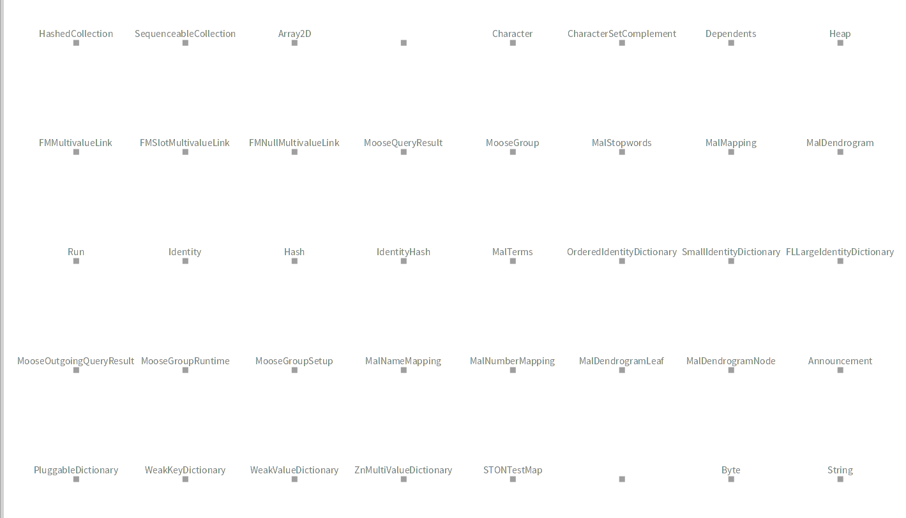
  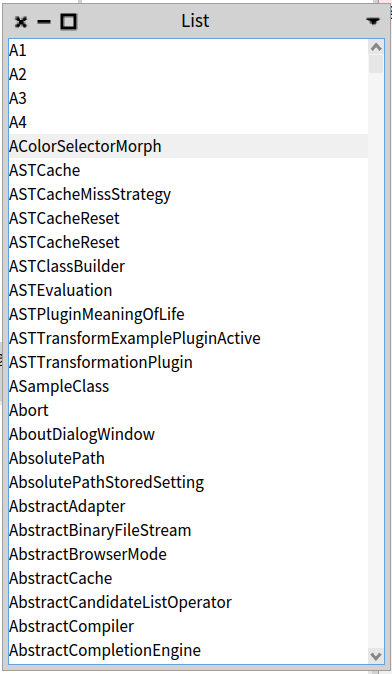 
</p>

9- LbCRemoveVowelsStrategy: consists in removing all the vowels (the letter 'y' is an exception in English, it's removed only when it represents a vowel) from the string.
<p float="left">
  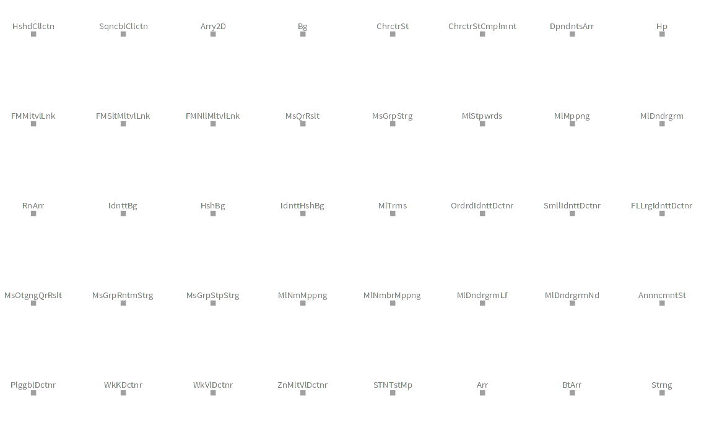
  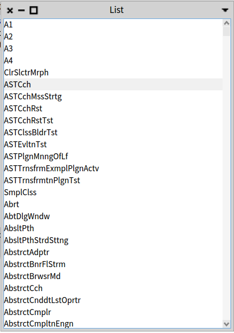 
</p>